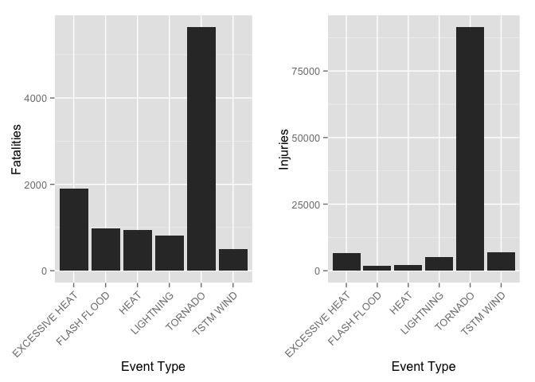
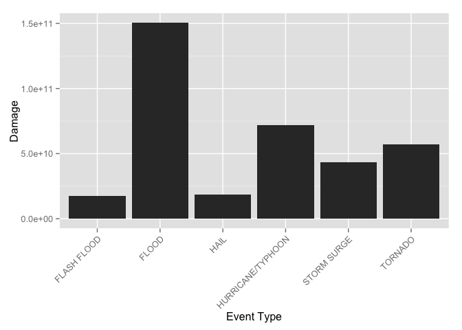

# Analysis about the characteristics of major storms and weather events in the United States


### Synopsis
This analysis involves exploring the U.S. National Oceanic and Atmospheric Administration's (NOAA) storm database. This database tracks characteristics of major storms and weather events in the United States, including when and where they occur, as well as estimates of any fatalities, injuries, and property damage. The purpose of this analysis is to show which type of event has the most harmful characteristics by the number of fatalities and injuries and to show which one has the most economical damage by the sum of damage to property and crop.


### Data Processing
The downloaded data file was compressed as 'bz2' type.

```r
setwd("~/dropbox/coursera/5RR/week3")
library(plyr); library(dplyr)
```

```
## 
## Attaching package: 'dplyr'
## 
## The following objects are masked from 'package:plyr':
## 
##     arrange, count, desc, failwith, id, mutate, rename, summarise,
##     summarize
## 
## The following object is masked from 'package:stats':
## 
##     filter
## 
## The following objects are masked from 'package:base':
## 
##     intersect, setdiff, setequal, union
```

```r
library(ggplot2); library(gridExtra)
```

```
## Loading required package: grid
```

```r
dat <- read.csv(bzfile("repdata-data-StormData.csv.bz2"))
dim(dat)
```

```
## [1] 902297     37
```

```r
names(dat) <- tolower(names(dat))
```


### 1. Across the United States, which type of events (as indicated in the EVTYPE variable) are most harmful with respect to population health?
Two new columns for each sum of 'fatalities' and 'injuries' are added to the original dataset. Data table was rearranged by the sum of 'harm' column.

```r
dat <- dat %>% 
    group_by(evtype) %>% 
    mutate(harm = sum(fatalities)) %>% 
    mutate(harm2 = sum(injuries))
dat1 <- dat[!duplicated(dat$evtype),]
dat1 <- data.frame(dat1)
dat2 <- dat1 %>% arrange(desc(harm)) %>% # arranged by fatalities
    select(evtype, fatalities, injuries, harm, harm2)
```


### Results

```r
dat2a <- head(dat2)
p1 <- ggplot(dat2a, aes(x=factor(evtype), y=harm)) + geom_bar(stat='identity') +
    labs(x='Event Type', y='Fatalities') +
    theme(axis.text.x = element_text(angle = 45, vjust = 1, hjust=1))
p2 <- ggplot(dat2a, aes(x=factor(evtype), y=harm2)) + geom_bar(stat='identity') +
    labs(x='Event Type', y='Injuries') +
    theme(axis.text.x = element_text(angle = 45, vjust = 1, hjust=1))
grid.arrange(p1, p2, ncol=2)
```

 


### The Answer is 'TORNADO'


### 2. Across the United States, which type of events have the greatest economic consequences?
Two new columns for each sum of 'property damage' and 'crop damage' are added to the original dataset. Data table was rearranged by the sum of both damage column ('dmg').


```r
dat3 <- dat %>%
    mutate(propexp = ifelse(propdmgexp=='K', 1000, 
           ifelse(propdmgexp=='M', 1e+06,
           ifelse(propdmgexp=='B', 1e+09, 1)))) %>%
    mutate(prop = propdmg * propexp) %>%
    mutate(cropexp = ifelse(cropdmgexp=='K', 1000, 
                            ifelse(cropdmgexp=='M', 1e+06,
                                   ifelse(cropdmgexp=='B', 1e+09, 1)))) %>%
    mutate(crop = cropdmg * cropexp) %>%
    group_by(evtype) %>% 
    mutate(propsum = sum(prop)) %>% 
    mutate(cropsum = sum(crop)) %>%
    select(bgn_date, state, county, evtype, prop, propsum, crop, cropsum)
dat4 <- dat3[!duplicated(dat3$evtype),]
dat4 <- data.frame(dat4)
dat4 <- dat4 %>%
    mutate(dmg = propsum + cropsum) %>%
    select(evtype, dmg) %>%
    arrange(desc(dmg))
```


### Results

```r
dat4a <- head(dat4)
ggplot(dat4a, aes(x=factor(evtype), y=dmg)) + geom_bar(stat='identity') +
    labs(x='Event Type', y='Damage') +
    theme(axis.text.x = element_text(angle = 45, vjust = 1, hjust=1))
```

 

### The Answer is 'FLOOD'
